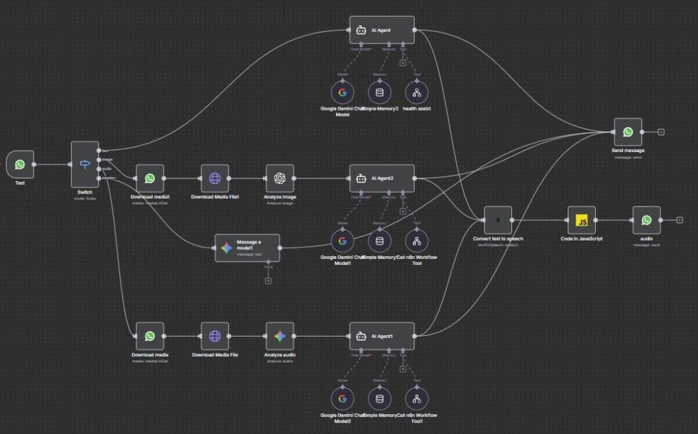
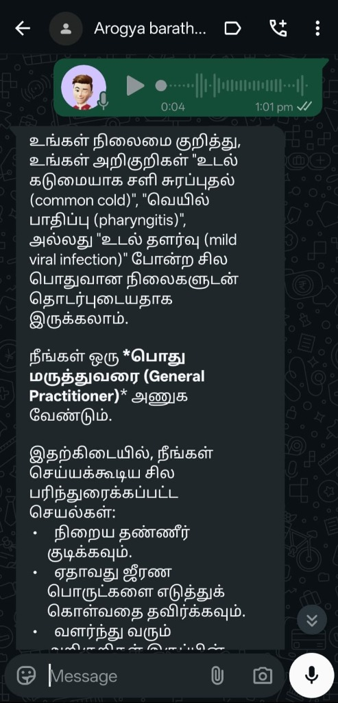
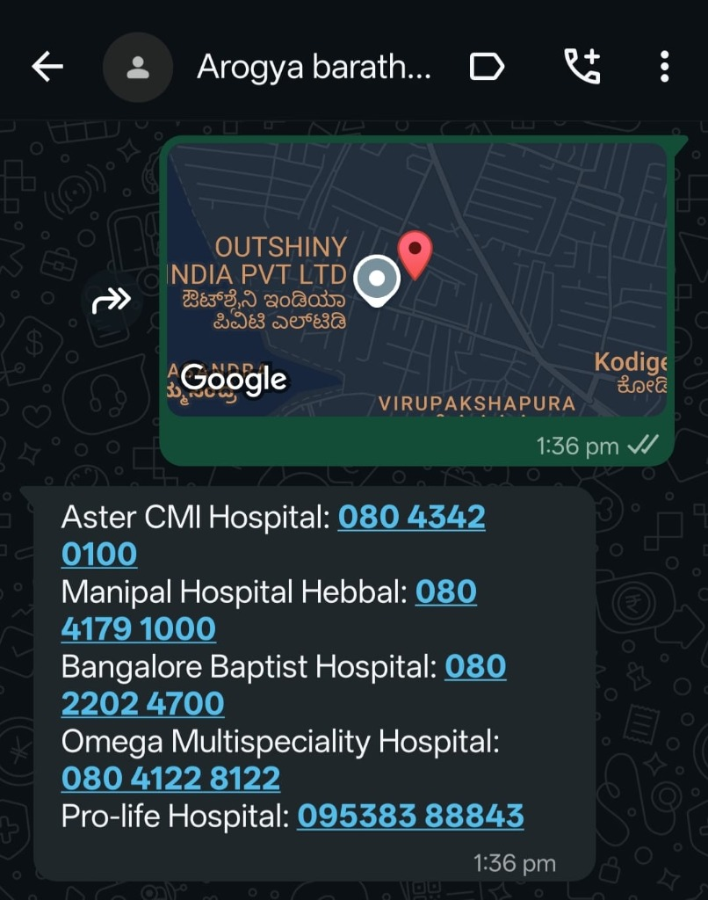
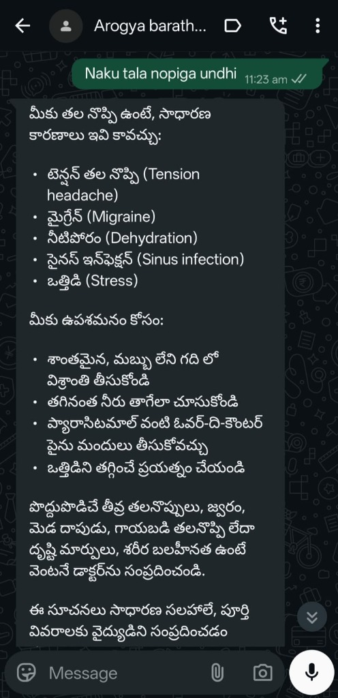

# 🏥 AI Health WhatsApp Bot

> An AI-powered public health chatbot accessible via WhatsApp, designed for accessibility and disease awareness in India.


---

## 🎯 Problem Statement

Healthcare information remains inaccessible for millions in rural India due to:
- **Language barriers** — most health resources are in English
- **Digital literacy gaps** — complex apps are hard to navigate
- **Limited internet access** — WhatsApp works even on low bandwidth

This project brings **AI-powered health guidance** directly to WhatsApp — the app people already use daily.

---

## ✨ Features

| Feature | Description |
|---------|-------------|
| 💬 **Multi-Modal Input** | Send text, voice notes, or images |
| 🌍 **Regional Language Support** | Responds in Tamil, Telugu, Hindi, English, and more |
| 🔊 **Voice Replies** | Audio responses for users who prefer listening |
| 🖼️ **Image Analysis** | AI analyzes medical images and provides guidance |
| 🚨 **Emergency Assistance** | Share location → Get nearby hospital contacts |
| ⚕️ **Medical Disclaimers** | Clear guidance on seeking professional help |

---

## 📸 Screenshots

### n8n Workflow Architecture


### Image Analysis (English)
*User sends skin condition image → AI provides possible conditions and recommends dermatologist*


### Voice Response (Tamil)
*User sends voice note describing symptoms → AI responds in Tamil with health guidance*



### Hospital Locator
*User shares location → AI provides nearby hospital names and contact numbers*



### Text Response (Telugu)
*User types symptoms in Telugu → AI responds with advice in Telugu*



---

## 🏗️ System Architecture

```
┌─────────────────┐     ┌─────────────────┐     ┌─────────────────┐
│   WhatsApp      │────▶│      n8n        │────▶│  Google Gemini  │
│   Business API  │◀────│   (Orchestrator)│◀────│   / OpenAI      │
└─────────────────┘     └────────┬────────┘     └─────────────────┘
                                 │
                                 ▼
                        ┌─────────────────┐
                        │   ElevenLabs    │
                        │   (Voice TTS)   │
                        └─────────────────┘
```

### Message Type Handling

| Input Type | Processing Pipeline |
|------------|---------------------|
| **Text** | Switch → AI Agent → Gemini → Response |
| **Image** | Switch → Download → OpenAI Vision → AI Agent → Response |
| **Audio** | Switch → Download → Gemini Audio Analysis → AI Agent → Voice Response |
| **Location** | Switch → Gemini → Hospital Search → Response |

---

## 🛠️ Tech Stack

| Component | Technology |
|-----------|------------|
| **Messaging Platform** | WhatsApp Business API (Meta) |
| **Workflow Automation** | n8n (self-hosted or cloud) |
| **AI/LLM** | Google Gemini 2.5 Pro/Flash |
| **Image Analysis** | OpenAI GPT-4o-mini |
| **Text-to-Speech** | ElevenLabs |
| **Language Processing** | Native multilingual (auto-detect) |

---

## 📁 Project Structure

```
ai-health-whatsapp-bot/
├── README.md
├── LICENSE
├── .env.example
├── .gitignore
├── screenshots/
│   ├── workflow.jpg
│   ├── image-analysis-english.jpg
│   ├── voice-response-tamil.jpg
│   ├── hospital-locator.jpg
│   └── text-response-telugu.jpg
├── architecture/
│   └── system-diagram.md
├── n8n/
│   └── Main.json              # Sanitized n8n workflow
├── prompts/
│   └── health-assistant.md    # System prompts for AI
└── docs/
    └── setup-guide.md
```

---

## 🚀 Getting Started

### Prerequisites

- WhatsApp Business API access (via Meta)
- n8n instance (cloud or self-hosted)
- Google Cloud API key (for Gemini)
- OpenAI API key (for image analysis)
- ElevenLabs API key (for voice)

### Setup

1. **Clone the repository**
   ```bash
   git clone https://github.com/Niru-26016/ai-health-whatsapp-bot.git
   cd ai-health-whatsapp-bot
   ```

2. **Configure environment variables**
   ```bash
   cp .env.example .env
   # Edit .env with your API keys
   ```

3. **Import n8n workflow**
   - Open your n8n instance
   - Go to Workflows → Import from File
   - Select `n8n/Main.json`
   - Update credentials in the workflow nodes

4. **Configure WhatsApp webhook**
   - Set your n8n webhook URL in Meta Business Suite
   - Verify the webhook connection

---

## ⚠️ Important Disclaimer

> **This project is NOT a medical device and does NOT replace professional medical advice.**
>
> The AI provides general health information only. Users are always advised to consult qualified healthcare professionals for medical concerns. In emergencies, users should contact local emergency services (108 for Ambulance, 112 for Emergency in India).

---

## 🔒 Security Notes

- All API keys and credentials have been removed from this repository
- Never commit sensitive tokens to version control
- Use environment variables for all secrets
- WhatsApp conversations are not stored or logged

---

## 🎓 What I Learned

- Building accessible AI systems for **real users** with **real constraints**
- Integrating multiple AI models (Gemini + OpenAI + ElevenLabs) via n8n
- Handling **multi-modal inputs** (text, voice, image, location)
- Designing for **low-bandwidth, multilingual environments**
- Importance of **clear medical disclaimers** in health-tech

---

## 📝 License

This project is licensed under the MIT License — see the [LICENSE](LICENSE) file for details.

---

## 🤝 Connect

Built by **Niranjan** for Smart India Hackathon 2025

- 💼 [LinkedIn](https://www.linkedin.com/in/niranjanreddy26)
- 🐙 [GitHub](https://github.com/Niru-26016)

---

*"Didn't get selected — but built something that actually works."* 🚀
